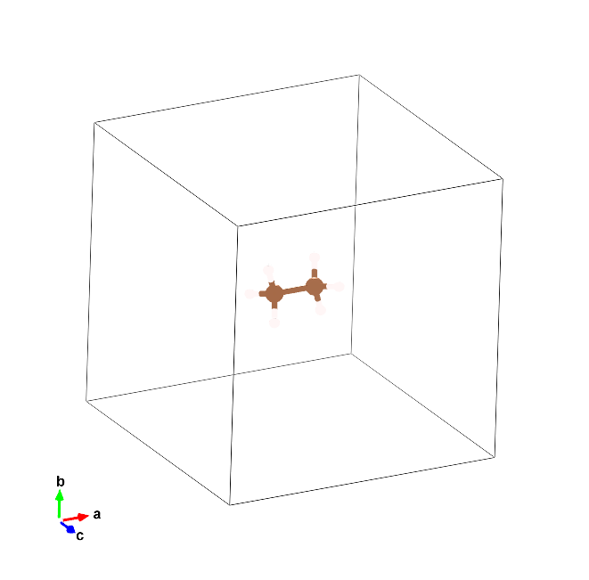

<div id="toc">

 

  <ul style="list-style: none">
    <summary>
      <h2> <pre>SMILESbox - generating simulation cells from SMILES</pre></h2>
    </summary>
  </ul>
</div>

#### Installation:

```
git clone https://github.com/badw/smilesbox.git 
cd smilesbox 
pip install . 
```

### Examples

an example Jupyter Notebook can be found here: 


`./examples/example.ipynb`


```
from smilesbox.smilesbox import SMILESbox
sb = SMILESbox()
sb.smiles_to_atoms('CC')
sb.add_box([10,10,10])
sb.save('molecule.vasp')
```


<p align="center">

</p>


### ToDo: 

- [ ] make different cell shapes 
- [ ] add more than one molecule to the cell 
- [ ] apply to surface slab models 

